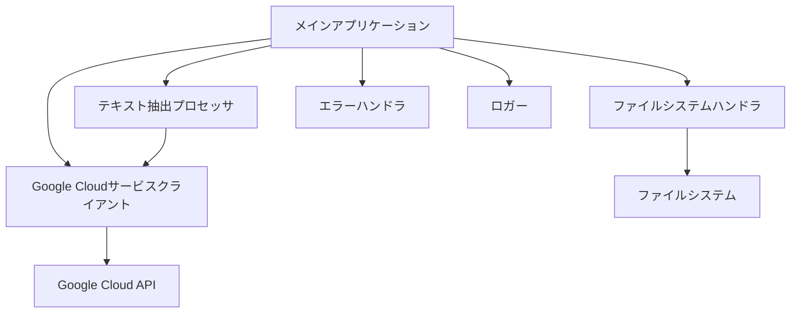

# 設計ドキュメント

## 概要

このプログラムは、指定されたディレクトリ内の PDF ファイルを検索し、Google Cloud Vision API または Google Cloud Document AI を使用してテキストを抽出する TypeScript アプリケーションです。Deno ランタイムを使用して実装され、コマンドラインから実行できるようになります。

## アーキテクチャ

アプリケーションは以下の主要コンポーネントで構成されます：

1. **メインアプリケーション** - コマンドライン引数を解析し、処理フローを制御
2. **ファイルシステムハンドラ** - ディレクトリのスキャンとファイル操作を担当
3. **Google Cloud サービスクライアント** - Vision API または Document AI との通信を処理
4. **テキスト抽出プロセッサ** - PDF からテキスト抽出のロジックを実装
5. **エラーハンドラ** - エラー処理とリトライロジックを提供
6. **ロガー** - 処理状況とエラーのログ記録



## コンポーネントとインターフェース

### メインアプリケーション

```typescript
interface AppConfig {
  inputDir: string;
  outputDir?: string;
  apiType: "vision" | "documentai";
  filePattern?: string;
  concurrency?: number;
  verbose?: boolean;
}

class PdfTextExtractor {
  constructor(config: AppConfig);
  async run(): Promise<ProcessingSummary>;
}
```

### ファイルシステムハンドラ

```typescript
interface FileSystemHandler {
  scanDirectory(dir: string, pattern?: string): Promise<string[]>;
  saveTextToFile(text: string, outputPath: string): Promise<void>;
}

class DenoFileSystemHandler implements FileSystemHandler {
  // DenoのファイルシステムAPIを使用した実装
}
```

### Google Cloud サービスクライアント

```typescript
interface CloudOcrClient {
  authenticate(): Promise<void>;
  extractTextFromPdf(pdfPath: string): Promise<string>;
}

class VisionApiClient implements CloudOcrClient {
  // Google Cloud Vision APIを使用した実装
}

class DocumentAiClient implements CloudOcrClient {
  // Google Cloud Document AIを使用した実装
}
```

### テキスト抽出プロセッサ

```typescript
interface TextExtractionResult {
  text: string;
  pageCount: number;
  successful: boolean;
  error?: Error;
}

class PdfTextProcessor {
  constructor(client: CloudOcrClient);
  async processFile(filePath: string): Promise<TextExtractionResult>;
}
```

### エラーハンドラ

```typescript
class RetryableError extends Error {
  // リトライ可能なエラーを表すクラス
}

class RetryHandler {
  async withRetry<T>(
    operation: () => Promise<T>,
    maxRetries: number,
    delayMs: number
  ): Promise<T>;
}
```

### ロガー

```typescript
enum LogLevel {
  DEBUG,
  INFO,
  WARN,
  ERROR,
}

interface Logger {
  log(level: LogLevel, message: string, data?: unknown): void;
  debug(message: string, data?: unknown): void;
  info(message: string, data?: unknown): void;
  warn(message: string, data?: unknown): void;
  error(message: string, error?: Error): void;
}

class ConsoleLogger implements Logger {
  // コンソールへのログ出力実装
}
```

## データモデル

### 処理サマリー

```typescript
interface ProcessingSummary {
  totalFiles: number;
  successfulFiles: number;
  failedFiles: number;
  skippedFiles: number;
  totalTimeMs: number;
  errors: ProcessingError[];
}

interface ProcessingError {
  filePath: string;
  error: string;
  timestamp: Date;
}
```

### ファイル情報

```typescript
interface PdfFileInfo {
  path: string;
  size: number;
  lastModified: Date;
  outputPath: string;
}
```

## エラー処理

アプリケーションは以下のエラーシナリオを処理します：

1. **認証エラー** - Google Cloud 認証情報が不足または無効
2. **ファイルシステムエラー** - ファイルの読み取り/書き込みエラー
3. **API 通信エラー** - Google Cloud API との通信エラー
4. **レート制限エラー** - API レート制限に達した場合
5. **無効な PDF エラー** - 処理できない PDF ファイル

エラー処理戦略：

- 一時的なエラー（ネットワーク、レート制限）に対しては指数バックオフを使用したリトライ
- 永続的なエラー（認証、無効なファイル）はログに記録し、次のファイルに進む
- すべてのエラーは詳細なコンテキスト情報とともにログに記録

## テスト戦略

1. **ユニットテスト**

   - 各コンポーネントの分離されたテスト
   - モックを使用した Google Cloud API の依存関係のテスト

2. **統合テスト**

   - コンポーネント間の相互作用のテスト
   - ファイルシステム操作のテスト

3. **エンドツーエンドテスト**
   - サンプル PDF ファイルを使用した完全なフロー
   - エラーシナリオのテスト

## パフォーマンス最適化

1. **並行処理**

   - 設定可能な並行性レベルでの複数ファイルの同時処理
   - Deno の`Promise.all`と`AbortController`を使用した制御

2. **バッチ処理**

   - 大きな PDF ファイルをページバッチで処理
   - API コールの最適化

3. **進行状況追跡**
   - 大きなファイルや多数のファイルの処理中の進行状況表示
   - 推定残り時間の計算

## セキュリティ考慮事項

1. **認証情報の管理**

   - 環境変数または Deno の権限システムを使用した安全な認証情報の管理
   - 認証情報のログへの漏洩防止

2. **入力検証**

   - すべてのユーザー入力の検証
   - パスインジェクション攻撃の防止

3. **エラーメッセージ**
   - センシティブ情報を含まないエラーメッセージ
   - 詳細なデバッグ情報は開発モードでのみ表示
